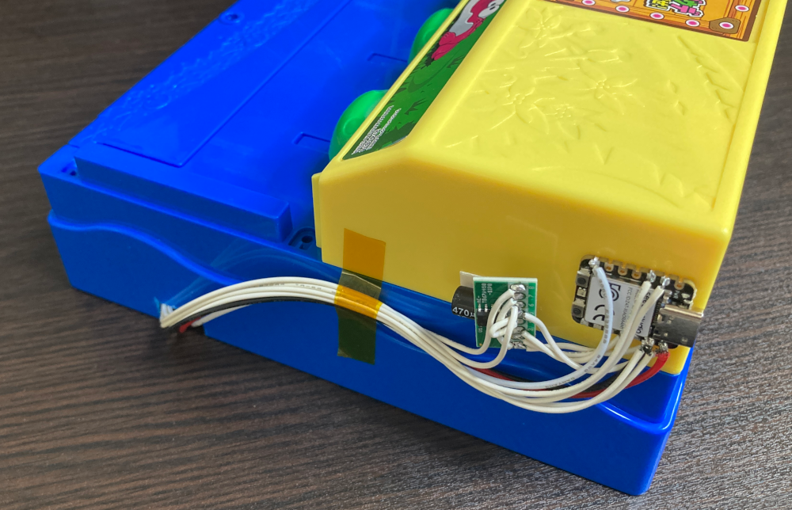

# waniwanipanic_device

## BOM

* x1 [Wani Wani Panic](https://toy.bandai.co.jp/series/game-variety/item/detail/14001/)
* x1 [Seeed Studio XIAO RA4M1](https://www.seeedstudio.com/Seeed-XIAO-RA4M1-p-5943.html)
* x1 [Grove - MP3 Module V4.0](https://www.seeedstudio.com/Grove-MP3-V4-p-5862.html)
* x1 [TB67H450 Motor Driver Module](https://akizukidenshi.com/catalog/g/g114753/)

## Block Diagram

## State

# Links

* [画像1枚からアノテーションレスで物体検出AIモデル開発](https://zenn.dev/mkj/articles/2a0b7f9788578d)
